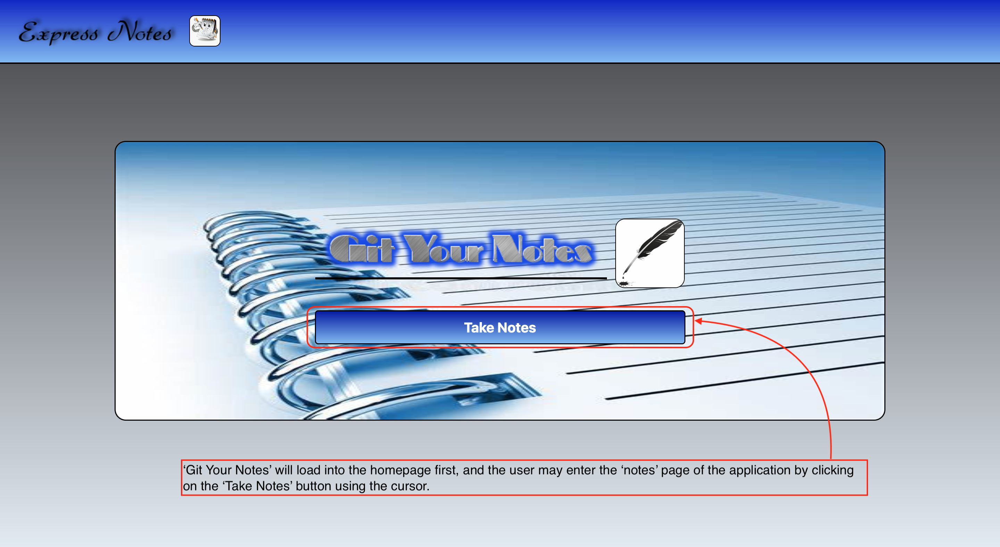
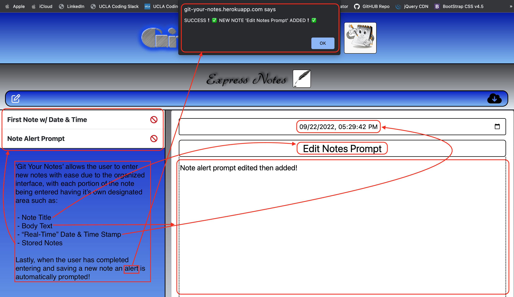
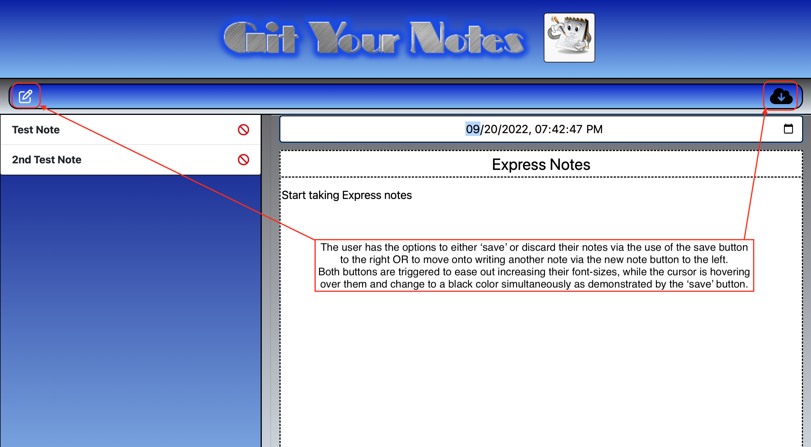
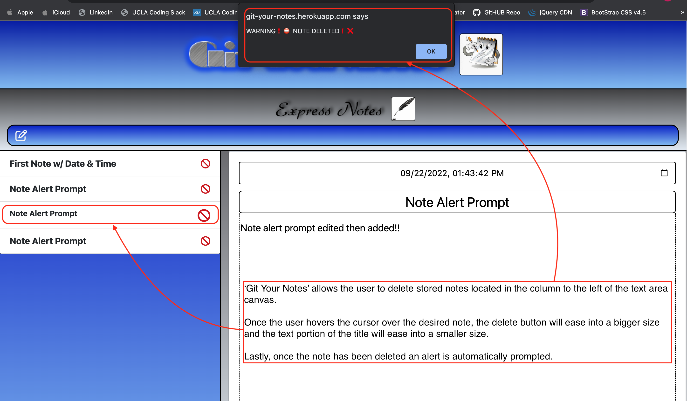
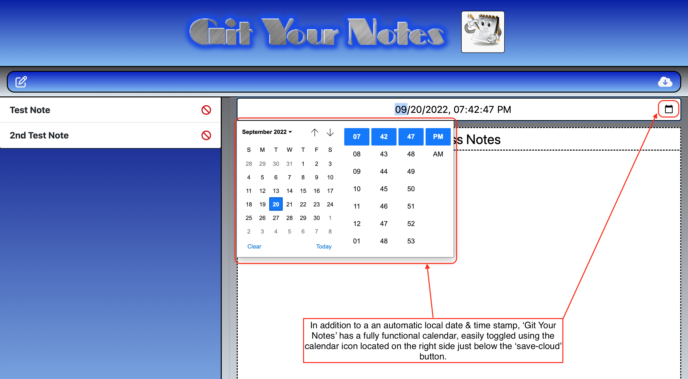
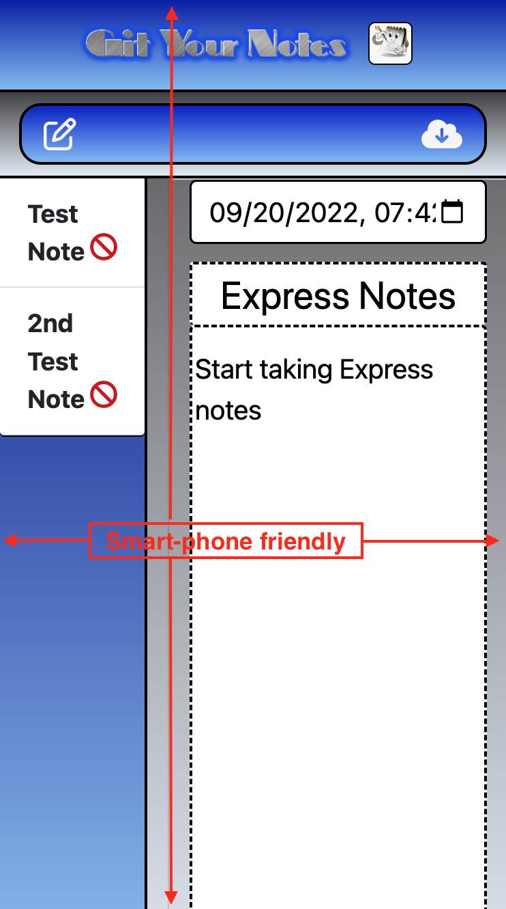
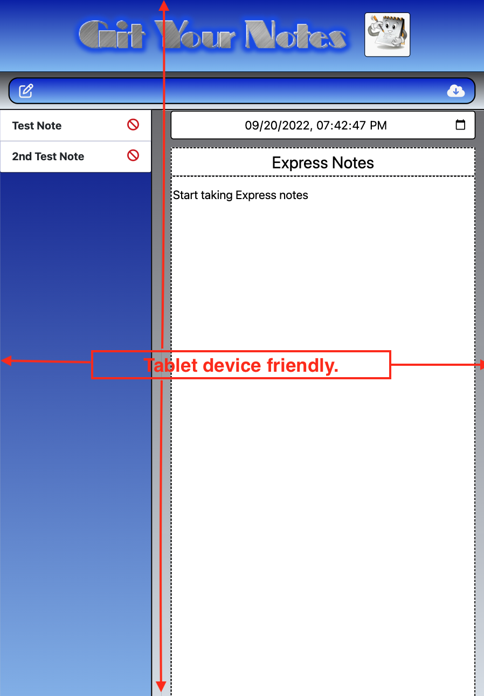

# **Git Your Notes** [](#isc-license)
---
  
## Overview
---
  **'Git Your Notes'** is a note taker application powered by ```Express.js``` and ```JSON``` files to store, retrieve and organize a user's notes. Additionally, ```http://localhost:3001/api/notes``` will be used to run app locally and to access the ```JSON``` files.

  This application was designed to compartmentalize the note-taking process with a digital twist made possible by utilizing the dynamic ```JavaScript``` and  ```HTML``` languages. **'Git Your Notes'** allows a user to enter the title, text, and date/time associated with their corresponding note. All user inputted data is conveniently stored directly beside the note-taking canvas for easy access to edit and delete the selected notes. Overall, this application has been developed to create a user-friendly way to take, store, and edit general notes.


## Table of Contents
---

  * [Overview](#overview)
  * [User Story](#user-story)
  * [Acceptance Criteria](#acceptance-criteria)
  * [Mock Up](#mock-up)
  * [GitHUB Repository](#github-repository)
  * [Evaluation Guideline](#evaluation-guideline)
  * [Contact Info](#contact-info)
  * [License](#isc-license)
  
## User Story
---
```
AS A small business owner
I WANT to be able to write and save notes
SO THAT I can organize my thoughts and keep track of tasks I need to complete
```

## Acceptance Criteria
---
```
GIVEN a note-taking application
WHEN I open the Note Taker
THEN I am presented with a landing page with a link to a notes page
WHEN I click on the link to the notes page
THEN I am presented with a page with existing notes listed in the left-hand column, plus empty fields to enter a new note title and the note’s text in the right-hand column
WHEN I enter a new note title and the note’s text
THEN a Save icon appears in the navigation at the top of the page
WHEN I click on the Save icon
THEN the new note I have entered is saved and appears in the left-hand column with the other existing notes
WHEN I click on an existing note in the list in the left-hand column
THEN that note appears in the right-hand column
WHEN I click on the Write icon in the navigation at the top of the page
THEN I am presented with empty fields to enter a new note title and the note’s text in the right-hand column
```
## Usage
---
**'Git Your Notes'** is an application used to store and retrieve a user's notes, via Express.js powering the back-end along with JSON files being used as a storage point.

## Mock-Up
---
> **Note:** The following images show **'Git Your Notes'** appearance and functionality:

### **Homepage:**
---


### **Main Page:**
---


### **Save Notes:**
---


### **Delete Notes:**
---


### **Calendar:**
---


### **Smart-Phone Capable:**
---


### **Tablet Device Capable:**
---

 
## Deployed Webpage URL
---
> https://git-your-notes.herokuapp.com/

## GitHUB Repository
---
> https://github.com/AASports89/git-your-notes

## Evaluation Guideline
---
> **Note**: The following evaluation guideline is used to determine if **'Git Your Notes'** meets the requirements for a minimum viable product:


### Technical Acceptance Criteria: 40%

* Satisfies all of the preceding acceptance criteria plus the following:

* Application front end must connect to an Express.js back end.

* Application back end must store notes that have a unique id in a JSON file.

* Application must be deployed to Heroku.


### Deployment: 36%

* Application deployed at live URL.

* Application loads with no errors.

* Application GitHub URL submitted.

* GitHub repository contains application code.


### Application Quality: 11%

* Application console is free of errors.


### Repository Quality: 13%

* Repository has a unique name.

* Repository follows best practices for file structure and naming conventions.

* Repository follows best practices for class/id naming conventions, indentation, quality comments, etc.

* Repository contains multiple descriptive commit messages.

* Repository contains quality README file with description, screenshot, and link to deployed application.


### Bonus: +10 Points

* Application allows users to delete notes.


## Review

You are required to submit BOTH of the following for review:

* The URL of the functional, deployed application.

* The URL of the GitHub repository, with a unique name and a README describing the project.

## Contact Info
---
> **Note:** Any Questions? 
> * Please visit my deployed application webpage  @https://git-your-notes.herokuapp.com/
> * Additionally, you can view the source code for this project and others @https://github.com/AASports89/git-your-notes

## **ISC License**
---
**Copyright © 2022 - AASports89**

Permission to use, copy, modify, and/or distribute this software for any purpose with or without fee is hereby granted, provided that the above copyright notice and this permission notice appear in all copies.

THE SOFTWARE IS PROVIDED "AS IS" AND THE AUTHOR DISCLAIMS ALL WARRANTIES WITH REGARD TO THIS SOFTWARE INCLUDING ALL IMPLIED WARRANTIES OF MERCHANTABILITY AND FITNESS. IN NO EVENT SHALL THE AUTHOR BE LIABLE FOR ANY SPECIAL, DIRECT, INDIRECT, OR CONSEQUENTIAL DAMAGES OR ANY DAMAGES WHATSOEVER RESULTING FROM LOSS OF USE, DATA OR PROFITS, WHETHER IN AN ACTION OF CONTRACT, NEGLIGENCE OR OTHER TORTIOUS ACTION, ARISING OUT OF OR IN CONNECTION WITH THE USE OR PERFORMANCE OF THIS SOFTWARE.

---
---
